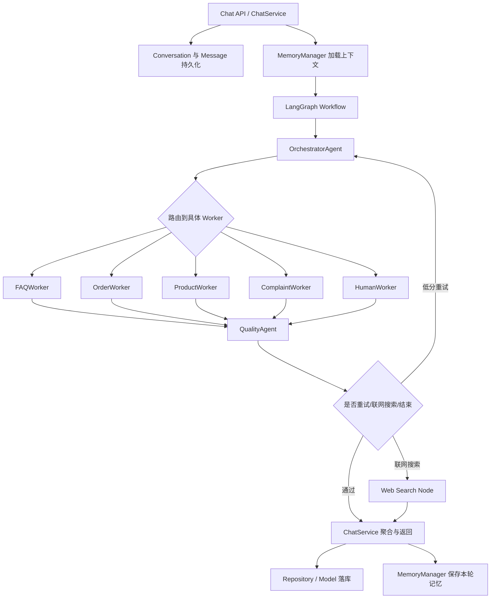

# 多智能体客服系统核心后端框架讲解

## 1. 核心处理链路总览

这套系统的后端不是“用户提问 -> 大模型直接回答”的单跳结构，而是一条分层明确的处理链路。用户消息进入后端后，会先经过会话与消息持久化，再加载历史上下文和用户记忆，然后进入 LangGraph 工作流，由 Orchestrator 判断意图并路由给合适的 Worker。Worker 完成专项处理后，还会再经过质量审查，最后才回到服务层落库、更新记忆并返回结果。

当前代码中的核心链路可以概括为：



从源码职责来看，各层分工如下：

- `services/` 负责业务入口与总控，核心是 `ChatService`
- `agents/` 负责多智能体编排、路由、质量审查和摘要生成
- `agents/workers/` 负责不同客服业务的专项处理
- `rag/` 负责知识检索、图检索、向量检索和重排序
- `memory/` 负责短期记忆、工作记忆、长期用户画像
- `repositories/` 和 `models/` 负责数据库读写与领域对象建模

这意味着系统的“智能性”不是堆在一个类里，而是拆分成多个层次协作完成。

---

## 2. Agent 层：智能体编排与质量控制

Agent 层的作用是把一次用户请求变成一条可控、可复查、可扩展的处理流程。它不直接承担具体业务，而是决定“现在应该做什么”“交给谁做”“做完后是否可信”。

相关代码主要位于：

```text
src/agents/
├── graph/
│   ├── workflow.py
│   ├── nodes.py
│   └── edges.py
├── orchestrator/
│   ├── agent.py
│   ├── router.py
│   └── state.py
├── quality_agent.py
└── summary_agent.py
```

### 2.1 AgentState：工作流的共享状态

`src/agents/orchestrator/state.py` 中定义了 `AgentState`。这是 LangGraph 工作流中流转的统一状态对象，所有节点都围绕它进行读写。

它包含的核心字段有：

- `messages`：历史消息，供 Worker 理解上下文
- `user_input`：本轮用户输入
- `conversation_id`、`user_id`：当前会话和用户标识
- `intent`：识别出的意图
- `worker_type`：当前被选中的 Worker
- `worker_result`：Worker 输出结果
- `context`：附加上下文信息
- `response`：最终响应
- `web_search`、`web_search_result`：联网搜索相关状态
- `sentiment`、`urgency`：情绪与紧急程度
- `working_memory`：当前任务快照
- `retry_count`、`quality_score`、`quality_reason`、`quality_risk_flags`：质量审查与重试控制

可以把 `AgentState` 理解成一张在节点之间不断补充内容的“任务单”。Orchestrator 负责写入意图和路由，Worker 负责写入处理结果，QualityAgent 负责写入评分和风险标签，ChatService 最终读取这些结果做返回和持久化。

### 2.2 LangGraph Workflow：把多个 Agent 串成图

`src/agents/graph/workflow.py` 中定义了整个 LangGraph 图。

当前系统的主流程是：

```text
orchestrator
  -> faq_worker / order_worker / product_worker / complaint_worker / human_worker
  -> quality_review
  -> END / web_search / orchestrator
```

它的核心设计点有：

- 入口固定是 `orchestrator`
- Orchestrator 不直接生成最终答案，而是先判断路由
- 各 Worker 完成后统一进入 `quality_review`
- 质量不达标时允许回到 `orchestrator` 重试
- 开启联网搜索时可进入 `web_search` 节点补充实时信息

这种设计比“一个 Agent 干到底”更稳定，因为它把决策、执行、质检分开了。

### 2.3 nodes.py：图节点与具体类解耦

`src/agents/graph/nodes.py` 的作用是把 Orchestrator、Worker、QualityAgent 包装成 LangGraph 节点函数。文件里先创建单例实例，再用异步函数暴露给工作流。

例如：

```python
_orchestrator = OrchestratorAgent()
_faq_worker = FAQWorker()
_quality_agent = QualityAgent()

async def orchestrator_node(state):
    return await _orchestrator.process(state)

async def faq_worker_node(state):
    return await _faq_worker.process(state)
```

这样做的好处是，工作流层只关心节点名字和状态传递，不关心每个节点内部怎么实现，结构会比较清晰。

### 2.4 OrchestratorAgent：编排器本体

`src/agents/orchestrator/agent.py` 中的 `OrchestratorAgent` 是整个 Agent 层的核心。

它的 `process()` 方法主要做三件事：

1. 读取 `user_input`
2. 调用 `route_decision()` 执行意图识别、情绪分析、紧急度判断和 Worker 决策
3. 生成 `working_memory` 并写回状态

输出内容通常包括：

- `intent`
- `worker_type`
- `sentiment`
- `urgency`
- `working_memory`
- `context` 中补充的 `sub_tasks`、`reasoning`

除了路由，它还有一个 `aggregate_response()` 方法。当前实现中，如果没有联网搜索结果，就直接返回 Worker 的结果；如果存在联网搜索结果，就再调用一次大模型做聚合。这是为了兼顾性能和完整性：简单场景减少一次模型调用，复杂场景再做综合回答。

### 2.5 router.py：路由决策与升级逻辑

`src/agents/orchestrator/router.py` 定义了从意图到 Worker 的映射关系：

```python
INTENT_WORKER_MAP = {
    "faq": "faq_worker",
    "order": "order_worker",
    "product": "product_worker",
    "complaint": "complaint_worker",
    "human": "human_worker",
    "greeting": "faq_worker",
    "unknown": "faq_worker",
}
```

它不只是做普通分类，还加入了情绪升级逻辑：

- 如果用户愤怒且属于投诉场景，会提高紧急度
- 如果愤怒或沮丧达到阈值，系统可能直接转 `human_worker`
- 如果情绪不佳但尚未达到转人工阈值，会优先进入 `complaint_worker`

这说明路由决策并不是“问订单就进订单”，而是把客服场景里非常重要的情绪维度也纳入判断。

### 2.6 edges.py：流程控制器

`src/agents/graph/edges.py` 定义了条件边的选择逻辑。

其中最关键的是 `route_after_review()`：

- `quality_score < 3` 且还有重试机会时，回到 `orchestrator`
- 如果紧急度极高或用户情绪高危，直接结束当前流程
- 如果开启了 `web_search`，进入联网搜索节点
- 否则结束工作流

这相当于给整个工作流加了一层“闸门控制”，让每个回复都必须过质检。

### 2.7 QualityAgent：回答质量审查

`QualityAgent` 负责在 Worker 完成业务后再做一次统一检查。它不是为了生成业务答案，而是为了回答质量、风险和一致性负责。

它输出的核心字段是：

- `quality_score`
- `quality_reason`
- `quality_risk_flags`

这些结果会被后续边函数用于重试或结束决策。也就是说，这个系统不是“只要 Worker 说完了就直接返回”，而是默认认为回答还需要被检查一遍。

### 2.8 SummaryAgent：会话摘要支持型 Agent

`SummaryAgent` 是一个支持型 Agent，不参与每次业务路由，但负责生成会话标题、摘要和关键点，用于更好的会话管理和后续检索。

从设计上看，它主要服务三个目标：

- 把长会话压缩成简洁摘要
- 给会话生成更易识别的标题
- 提炼关键事实，供后续检索和展示

因此 Agent 层不仅有“执行型智能体”，还有“支持型智能体”。

---

## 3. Worker 层：专项业务智能体

Worker 层是真正承担业务处理的地方。Orchestrator 决定“交给谁”，Worker 决定“怎么做”。

相关代码位于：

```text
src/agents/workers/
├── base_worker.py
├── faq_worker.py
├── order_worker.py
├── product_worker.py
├── complaint_worker.py
├── human_worker.py
```

### 3.1 BaseWorker：所有 Worker 的统一外壳

`src/agents/workers/base_worker.py` 中的 `BaseWorker` 提供统一的 `process()` 流程。它做的事情包括：

- 读取 `user_input`
- 读取 `context`
- 从 `messages` 中整理最近几轮历史
- 把 `working_memory` 注入上下文
- 如果当前是重试轮次，把 `quality_reason` 注入上下文
- 调用子类的 `handle()` 实现真正业务处理
- 用统一格式返回 `{"worker_result": result}`

这层非常关键，因为它让所有 Worker 的入参与出参都标准化。上层工作流不需要知道某个 Worker 内部到底是调用工具、做检索还是直接问模型，只需要拿到 `worker_result`。

### 3.2 FAQWorker：FAQ 与规则问答

`FAQWorker` 的职责是处理常见问题、制度说明、规则类问答和兜底型问答。

它的处理流程比较直接：

1. 调用 `_retrieve_knowledge()` 获取知识库上下文
2. 把检索结果、用户问题、对话历史、人设信息拼进 Prompt
3. 调用 LLM 生成最终答复

这里的重点在于它默认优先使用知识检索，而不是让大模型裸答。这让 FAQWorker 成为 RAG 层最典型的消费者之一。

### 3.3 OrderWorker：订单查询与售后处理

`OrderWorker` 主要处理：

- 订单状态查询
- 物流追踪
- 用户订单列表
- 退货处理

它通过 `create_react_agent()` 挂载一组业务工具：

- `query_order`
- `query_user_orders`
- `process_return`

因此它不是“写死调用某个函数”，而是让模型根据用户问题自主决定要不要调用工具。例如用户问物流状态时，模型可以先查订单；用户要求退货时，模型可以尝试执行退货处理。

此外，OrderWorker 支持 MCP 增强模式，会接入淘宝 MCP 工具并将工具结果同步到数据库。这说明 Worker 层不仅能访问本地工具，还能接外部业务系统。

### 3.4 ProductWorker：商品咨询与推荐

`ProductWorker` 主要处理：

- 商品参数咨询
- 型号信息说明
- 商品推荐
- 用户当前关注商品的补充解释

它定义了一个本地工具 `search_products()`，内部调用 `HybridRetriever` 进行产品知识库检索。因此它本质上是“Agent + 工具 + RAG”的混合模式。

这类设计非常适合商品场景，因为商品问题往往既需要知识库内容，又可能需要来自外部平台的商品数据。当前实现里，ProductWorker 也支持 MCP 增强模式，会把本地工具和外部工具一起交给 Agent 使用。

### 3.5 ComplaintWorker：投诉与工单流转

`ComplaintWorker` 处理的是最典型的客服售后场景：

- 用户投诉
- 情绪安抚
- 创建工单
- 查询工单
- 升级工单

它挂载的工具包括：

- `create_ticket`
- `query_ticket`
- `escalate_ticket`

与普通问答 Worker 不同，ComplaintWorker 不只是回答问题，更强调“把售后动作做下去”。它还会读取情绪和紧急度信息：

- 情绪激动时，Prompt 会加强安抚要求
- 紧急度高时，会鼓励创建或升级工单
- 会话 ID 和用户 ID 会写入提示，便于工具调用时补齐上下文

也就是说，ComplaintWorker 是把“客服语言处理”和“售后流程执行”结合在一起的 Worker。

### 3.6 HumanWorker：转人工出口

`HumanWorker` 用于兜底和升级场景，例如：

- 用户明确要求人工客服
- 自动流程无法满足需求
- 情绪风险过高
- 问题复杂或敏感

在图节点中，`human_worker_node()` 还会额外设置 `needs_human = True`。这是一种显式标记，告诉后续系统这个会话已经需要人工介入。

### 3.7 Worker 层设计特点

从整体上看，当前 Worker 层有几个很明显的设计特点：

- 公共逻辑收敛在 `BaseWorker`
- 业务能力按领域拆分，边界明确
- 有的 Worker 偏问答，有的 Worker 偏工具执行
- 工具调用与 RAG 检索可以自由组合
- Worker 不直接决定整体流程，而是由 Agent 层统一调度

因此，Worker 层本质上是一组“按业务职能拆开的专家节点”。

---

## 4. RAG 层：知识增强检索

RAG 层的目标是解决一个现实问题：客服系统里有大量商品资料、FAQ、政策说明、知识图谱信息，这些内容不能只靠大模型参数记忆，也不适合每次手工硬编码。因此系统需要先检索，再生成。

相关代码位于：

```text
src/rag/
├── retriever.py
├── vector_store.py
├── graph_store.py
├── embeddings.py
├── reranker.py
└── indexer.py
```

### 4.1 HybridRetriever：统一检索入口

`src/rag/retriever.py` 中的 `HybridRetriever` 是整个 RAG 层的核心入口。它把多种检索方式整合成一个统一接口：

```python
await retriever.retrieve(
    query,
    top_k=5,
    use_vector=True,
    use_graph=True,
    use_reranker=True,
)
```

它支持的流程是：

1. 先进行向量检索
2. 再进行图检索
3. 若两边都有结果，则做 RRF 融合
4. 如启用了 reranker，则做最终重排序
5. 返回 top_k 条结果
6. 记录检索日志，便于监控和评估

这让调用者不必知道底层到底接了多少种存储或排序方式，只需要调用一个入口。

### 4.2 向量检索：按语义找内容

向量检索主要负责处理“用户问法和知识库原文不完全一致”的情况。

它的流程是：

1. 调用 `embed_text(query)` 生成查询向量
2. 调用 `VectorStore.search()` 在向量库中查找相似片段
3. 为返回结果打上 `source = "vector"` 标记

向量检索擅长处理：

- 自然语言表述多变的问题
- 同义表达
- 文本片段匹配
- 商品描述、FAQ 文档这类非结构化内容

### 4.3 图检索：按实体与关系找内容

图检索则更偏向实体和关系。

`HybridRetriever._graph_search()` 在真正检索前，会先对查询进行清洗和归一化，去掉“请问”“帮我查一下”“多少钱”这类噪声表达，再构造适合图搜索的关键词短语。

随后它会调用 `GraphStore.search_by_keyword()` 做图搜索，并把结果转换成统一的文档结构：

- `id`
- `content`
- `metadata`
- `score`
- `source = "graph"`

图检索适合处理：

- 商品型号与属性关系
- 品牌、类目、兼容关系
- 多跳关联推理
- 实体中心的知识查询

### 4.4 RRF 融合：整合多路召回

当向量检索和图检索同时返回结果时，系统使用 Reciprocal Rank Fusion 进行结果融合。

它的好处在于：

- 不强行依赖单一路径
- 可以综合“语义相似”和“实体关系”两种优势
- 某条内容如果在两边排名都靠前，就会得到更高的综合分

这比简单拼接结果更稳，因为它会重新考虑整体排序。

### 4.5 Reranker：最后一道排序优化

在融合结果之后，系统还可以调用 `Reranker` 对候选文档做最终排序。Reranker 的职责不是召回更多内容，而是让最相关的内容尽量排到前面。

这样设计的意义是：

- 召回阶段尽量“多找”
- 重排序阶段尽量“精挑”

如果 reranker 不可用，系统会降级为使用前面的融合结果，不会中断主流程。

### 4.6 RAG 层的日志与可观测性

`HybridRetriever` 还维护了一个 `_retrieval_logs` 队列，用于记录最近的检索行为，包括：

- 查询内容
- 向量召回数量
- 图召回数量
- 是否使用 reranker
- 平均分与最高分
- 延迟
- 返回来源

这说明 RAG 层并不是黑盒，而是做了基础的可观测性设计，方便后续评估召回质量。

### 4.7 RAG 层如何被上层使用

当前最典型的使用方式有两种：

- `FAQWorker` 直接调用 `HybridRetriever` 获取知识上下文
- `ProductWorker` 通过 `search_products()` 工具调用 `HybridRetriever`

这说明 RAG 层本身是通用服务层，不和某个 Worker 强耦合。只要新的业务 Worker 需要知识增强，就可以复用它。

---

## 5. Memory 层：多轮对话记忆管理

Memory 层负责解决系统如何“记住用户”和“记住这段对话”。

相关代码位于：

```text
src/memory/
├── memory_manager.py
├── working_memory.py
├── short_term_memory.py
├── long_term_memory.py
└── base.py
```

### 5.1 MemoryManager：统一记忆入口

`MemoryManager` 是整个记忆层的总协调器。`ChatService` 通过它来做两件核心事情：

- `load_context()`：在调用 Agent 前加载上下文
- `save_turn()`：在本轮处理完成后保存新记忆

因此 Memory 层不是单独运行的模块，而是深度嵌入在每次会话处理的前后两个阶段。

### 5.2 短期记忆：当前会话历史

短期记忆主要保存当前会话内部的多轮对话内容。

`load_context()` 会先读取短期记忆，再把历史消息转换成 LangChain 消息对象：

- 用户消息转成 `HumanMessage`
- 助手消息转成 `AIMessage`
- 系统消息转成 `SystemMessage`

这些消息随后被放入 `AgentState.messages`，再由 `BaseWorker` 格式化成文本历史，让 Worker 能理解上下文。

也就是说，短期记忆是“这次会话里刚刚发生了什么”的主要来源。

### 5.3 会话摘要：压缩长对话

当对话轮数变多时，直接把所有历史都塞给模型会带来上下文膨胀问题。为了解决这一点，`MemoryManager.save_turn()` 会在达到阈值后触发 `_compress_to_summary()`。

压缩过程大致是：

1. 取较早一半历史
2. 调用 LLM 生成摘要
3. 如果已经有旧摘要，则把旧摘要和新历史合并后重新压缩
4. 保存摘要
5. 只保留较新的历史消息

这样系统既保留了长对话的语义信息，又不会无限拉长上下文窗口。

### 5.4 长期记忆：用户画像

长期记忆的重点是跨会话保留用户信息，而不是单轮消息。

`load_context()` 在拿到 `user_id` 后，会尝试读取长期记忆中的用户画像，并将其作为一个高优先级 `SystemMessage` 注入上下文。画像里可能包括：

- `preferences`
- `entities`
- `tags`
- `interaction_summary`

这让系统在回答时不仅知道用户刚问了什么，还能知道这个用户长期偏好什么、关注过什么、是否有过某些历史问题。

### 5.5 工作记忆：当前任务快照

工作记忆和短期记忆、长期记忆不同，它不是为了长期保存，而是服务当前这一次工作流。

Orchestrator 在识别完意图、情绪、紧急度和子任务后，会构造一份 `working_memory`，内容例如：

- 当前意图
- 当前情绪
- 当前紧急度
- 任务拆解结果
- 决策推理说明

`BaseWorker` 会把这份工作记忆注入到 `context` 里。这样 Worker 在处理问题时，不需要重新猜测上层为什么把任务交给自己。

### 5.6 用户画像自动提取与后台更新

Memory 层还有一个比较实用的点：它会在每轮对话完成后尝试从用户与助手的对话中抽取画像信息。

`save_turn()` 中会异步触发：

```python
asyncio.create_task(
    self._safe_extract_profile(user_id, user_message, assistant_message)
)
```

随后 `_extract_and_update_profile()` 会调用 LLM 提取：

- `preferences`
- `entities`
- `tags`

如果提取到了有效结果，就更新长期记忆。

这种做法的好处是：

- 不阻塞当前回复返回
- 用户画像会随着对话持续成长
- 后续回答可以更个性化

### 5.7 Memory 层的整体作用

从整体上看，Memory 层同时处理了三类问题：

- 当前会话里刚刚聊了什么
- 长对话太长时如何压缩
- 这个用户长期是什么样的人

因此它并不是单纯“存聊天记录”，而是在为 Agent 和 Worker 提供稳定的上下文能力。

---

## 6. Repository / Model 层：数据持久化与领域模型

Repository / Model 层负责把系统里的关键业务对象结构化并持久化到数据库中。

相关代码位于：

```text
src/models/
├── conversation.py
├── message.py
├── user.py
├── ticket.py
├── feedback.py
├── taobao_user_data.py
├── user_profile.py
└── ...

src/repositories/
├── base.py
├── conversation_repo.py
├── message_repo.py
├── user_repo.py
├── cache_repo.py
└── ...
```

### 6.1 Model 层：描述系统里“有什么”

Model 层使用 SQLAlchemy ORM 定义领域对象及其关系。它解决的是“数据库里应该存什么”和“这些对象之间怎么关联”。

当前系统中最重要的几个模型包括：

- `Conversation`
- `Message`
- `User`
- `Ticket`
- `Feedback`
- `TaobaoUserData`
- `UserProfile`

### 6.2 Conversation：会话对象

`src/models/conversation.py` 中的 `Conversation` 表示一次完整客服会话。

关键字段包括：

- `id`
- `user_id`
- `title`
- `channel`
- `status`
- `summary`
- `is_pinned`
- `metadata_`

它还定义了较完整的状态机：

- `init`
- `active`
- `waiting`
- `transferring`
- `transferred`
- `closed`
- `timeout`

这说明系统对会话生命周期是有明确建模的，而不是只把聊天记录松散地堆在一起。

### 6.3 Message：消息对象

`src/models/message.py` 中的 `Message` 表示会话中的一条消息。

关键字段包括：

- `conversation_id`
- `role`
- `content`
- `intent`
- `worker_type`
- `tokens_used`
- `latency_ms`
- `metadata_`

这些字段意味着一条消息不仅保存文本，还保存了与智能体执行有关的元信息。例如这条回复是谁处理的、用了多少 token、耗时多久。后续做监控、分析、调优时，这些字段会非常有价值。

### 6.4 Ticket：售后工单对象

`Ticket` 主要服务于投诉和售后流程。它把“客服回答”进一步延伸到“售后流程管理”。

在系统中，ComplaintWorker 可以通过工具对 Ticket 执行创建、查询、升级等动作。这样投诉问题不只停留在语言回复层，而是能进入可追踪、可处理的工单链路。

### 6.5 Feedback：用户反馈对象

`Feedback` 模型保存用户对某条助手消息的评价。它和消息是一对一关联关系，用于存储评分和评论。

这为系统提供了来自用户侧的质量信号。相比纯自动评分，真实用户的低评分更能说明某条回答在体验上是否失败。

### 6.6 TaobaoUserData：外部业务数据承接

`TaobaoUserData` 用来承接从淘宝相关工具或同步服务获取到的用户订单、商品等数据。OrderWorker 和 ProductWorker 在 MCP 增强模式下会把工具结果同步到数据库，再被后续逻辑读取。

这说明 Model 层并不只存本地聊天数据，还承担了外部业务数据落地的角色。

### 6.7 Repository 层：描述“怎么读写”

如果 Model 层回答的是“有什么”，Repository 层回答的就是“怎么操作这些对象”。

例如在 `ChatService` 中：

```python
self.conv_repo = ConversationRepository(db)
self.msg_repo = MessageRepository(db)
```

随后会通过 Repository 去做：

- 获取或更新会话
- 创建用户消息
- 创建助手消息
- 更新会话标题

这样 Service 层不会被 ORM 细节污染得太重，代码职责会更清楚。

### 6.8 ChatService 与 Repository / Model 的协作

一次消息处理时，Service 层和 Repository / Model 的协作过程大致是：

1. 获取或创建 `Conversation`
2. 创建并保存用户 `Message`
3. 调用 MemoryManager 加载上下文
4. 调用 Agent 工作流得到结果
5. 创建并保存助手 `Message`
6. 提交事务
7. 更新会话标题、摘要或其他元数据

因此，Repository / Model 层不是辅助角色，而是承接了整个后端处理链路的状态落地。

---

## 7. 各层之间的协作关系

如果从架构角度重新看这几层，它们之间的协作关系可以归纳为：

- `ChatService` 是总入口，负责组织一次处理链路
- `MemoryManager` 在处理前提供上下文，在处理后保存记忆
- `Agent 层` 负责路由、流程控制、质量审查
- `Worker 层` 负责不同领域的实际业务处理
- `RAG 层` 给 FAQ、商品等知识密集型 Worker 提供检索能力
- `Repository / Model 层` 负责把会话、消息、工单、反馈和外部数据落库

用一句话概括就是：

> Service 组织流程，Agent 决定路径，Worker 执行业务，RAG 提供知识，Memory 提供上下文，Repository/Model 提供持久化。

这套协作方式有两个很明显的优点：

- 各层职责清晰，后续扩展不会牵一发动全身
- 上下文、业务执行、质量控制、持久化彼此解耦，系统更稳定

---

## 8. 如何扩展一个新的业务能力

如果现在要新增一个“优惠券 Worker”或“售后政策 Worker”，这套架构的扩展路径其实很清晰。

### 8.1 新增 Worker

在 `src/agents/workers/` 下新增一个文件，例如 `coupon_worker.py`，继承 `BaseWorker`，实现自己的 `handle()`。

如果是规则问答型 Worker，可以直接复用 RAG。
如果是动作执行型 Worker，可以像 OrderWorker、ComplaintWorker 一样挂业务工具。

### 8.2 接入 Agent 工作流

要让它真正进入系统，还需要修改几处：

- 在 `nodes.py` 中创建实例和节点函数
- 在 `workflow.py` 中注册节点
- 在 `router.py` 中扩展意图到 Worker 的映射
- 在相关 Prompt 中补充这种新意图的识别规则

这样 Orchestrator 才能把请求正确路由给它。

### 8.3 需要知识库时接入 RAG

如果新 Worker 依赖知识检索，例如“售后政策 Worker”，就可以直接调用 `HybridRetriever`。如果知识结构更偏实体关系，也可以偏重图检索。

### 8.4 需要数据操作时扩展 Model / Repository

如果这个新能力需要记录新类型的数据，例如优惠券、服务申请、换货记录，就应该新增对应的模型和 Repository。

这样做的原因是，Worker 不应该自己夹带大量数据库细节，否则上层与下层会重新耦合起来。

### 8.5 补充测试

新增能力后，至少要覆盖这些验证点：

- Orchestrator 能否正确识别并路由
- Worker 在正常输入下能否输出有效结果
- 质量审查是否还能正确工作
- 需要 RAG 时是否能正常召回和降级
- 需要数据读写时 Repository 是否按预期工作

这套扩展路径说明，当前架构不是一次性写死的，而是有明确扩展位的。

---

## 9. 小结

这套多智能体客服系统的后端核心，不是把所有能力都塞进一个“大模型问答类”里，而是拆成了几层彼此协作的模块：

- Agent 层负责编排、路由、质量控制
- Worker 层负责具体业务处理
- RAG 层负责知识增强检索
- Memory 层负责上下文与用户画像
- Repository / Model 层负责数据建模与持久化

这种分层方式最大的价值在于：系统既保留了大模型的灵活性，又通过工作流、质检、记忆和持久化把客服场景里真正需要的稳定性补上了。

如果只看功能，它是一个客服机器人；如果从实现角度看，它更像一套围绕客服业务设计的多智能体后端框架。后续无论是新增 Worker、接入更多外部系统，还是细化知识检索和长期记忆，这个结构都还能继续向前扩展。
