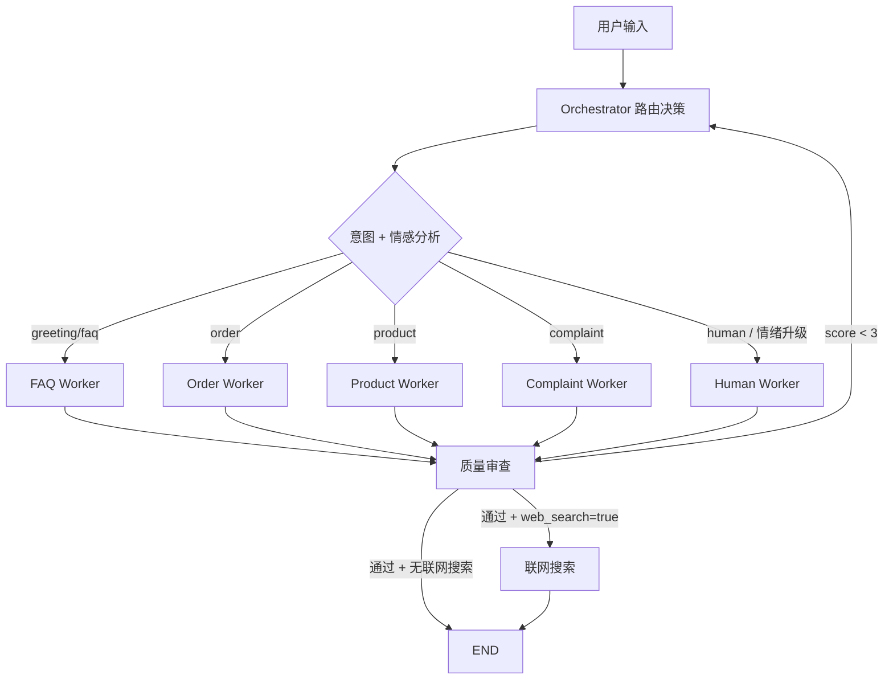

# 多智能体客服系统 — 全流程触发对话设计

> 本文档设计了一套完整的对话场景，**覆盖系统所有流程与分支**，包含 5 个 Worker、情绪升级、质量审查重试、联网搜索、退货流程、工单创建等。

---

## 系统流程总览



---

## 对话场景清单

下表标注每段对话触发的流程分支：

| # | 场景 | 触发的流程 |
|---|------|-----------|
| 1 | 打招呼 | Orchestrator → `greeting` → FAQ Worker |
| 2 | FAQ 常见问题 | FAQ Worker + RAG 检索 |
| 3 | 订单查询 | Order Worker + `query_order` 工具 |
| 4 | 查询用户订单列表 | Order Worker + `query_user_orders` 工具 |
| 5 | 退货流程（含确认） | Order Worker + `process_return` 工具 |
| 6 | 产品咨询/推荐 | Product Worker + `search_products` 工具 |
| 7 | 投诉处理 + 自动工单 | Complaint Worker + `create_ticket` 工具 |
| 8 | 主动请求人工客服 | Human Worker + 通知服务 |
| 9 | 愤怒情绪自动升级转人工 | 情绪升级 → Human Worker (critical) |
| 10 | 负面情绪路由到投诉 | `frustrated` 但未达升级阈值 → Complaint Worker |
| 11 | 联网搜索 | Worker → 质量审查 → Web Search Node |
| 12 | 质量审查重试 | Worker 输出低质量 → 重新路由 → Worker 改进回答 |
| 13 | Persona 切换（专业风格） | `professional` persona |
| 14 | Persona 切换（技术风格） | `technical` persona |
| 15 | 多轮对话 + 记忆 | 对话历史传递 + 上下文保持 |

---

## 完整对话脚本

> 💡 以下为一个**连续的客户对话过程**，按顺序触发所有流程。同时附带各条消息触发的系统内部流程说明。

---

### 第 1 轮：打招呼 → `greeting` → FAQ Worker

```
👤 用户: 你好
```

> **系统流程**：Orchestrator 识别 `intent=greeting`，路由到 `faq_worker`。FAQ Worker 用友好 persona 回复欢迎语。

```
🤖 客服: 你好呀！😊 欢迎来到我们的客服中心～有什么我可以帮助你的吗？
```

---

### 第 2 轮：FAQ 常见问题 → FAQ Worker + RAG 检索

```
👤 用户: 你们的退换货政策是什么？
```

> **系统流程**：`intent=faq` → FAQ Worker → `_retrieve_knowledge(query)` 从 GraphRAG 知识库检索退换货政策相关文档 → 结合 RAG 结果生成回复。

```
🤖 客服: 我们的退换货政策如下 📋
1. 自签收起 7 天内可无理由退换货
2. 商品需保持原包装完好、未使用
3. 退款将在收到退货后 1-3 个工作日内原路退回
如果您有具体订单需要退货，告诉我订单号就好～
```

---

### 第 3 轮：查询订单列表 → Order Worker + `query_user_orders`

```
👤 用户: 帮我查一下我最近买了什么
```

> **系统流程**：`intent=order` → Order Worker → React Agent 调用 `query_user_orders()` 工具 → 返回模拟订单列表。

```
🤖 客服: 这是您最近的订单哦 📦

• 【ORD-2024001】iPhone 16 Pro | 已发货 | ¥8,999
• 【ORD-2024002】AirPods Pro 2 | 已签收 | ¥1,899
• 【ORD-2024003】MacBook Air M3 | 处理中 | ¥9,499

需要查看某个订单的详细物流信息吗？告诉我订单号就好～
```

---

### 第 4 轮：查询具体订单 → Order Worker + `query_order`

```
👤 用户: 帮我看看 ORD-2024001 的物流到哪了
```

> **系统流程**：`intent=order` → Order Worker → React Agent 调用 `query_order("ORD-2024001")` → 返回订单详情及物流信息。

```
🤖 客服: 您的订单 ORD-2024001 的信息如下 🚚

📱 商品：iPhone 16 Pro
📋 状态：已发货
🚛 物流：顺丰速运 SF1234567890
💰 金额：¥8,999
📅 预计送达：2024-12-05

包裹已经在路上啦，很快就到了！😊
```

---

### 第 5 轮：退货流程（确认机制）→ Order Worker + `process_return`

```
👤 用户: 我想退掉 ORD-2024002 的 AirPods
```

> **系统流程**：`intent=order` → Order Worker → Agent 先调 `query_order("ORD-2024002")` 获取详情 → **按照 prompt 指令，必须先向用户确认再退货**。

```
🤖 客服: 我查到了您的订单 ORD-2024002 ：
📦 商品：AirPods Pro 2 | 状态：已签收 | 金额：¥1,899

您确定要退货 AirPods Pro 2 吗？确认后我会立即为您处理退货申请。
请回复"确认"或"取消"。
```

```
👤 用户: 确认
```

> **系统流程**：Order Worker 识别用户确认 → 调用 `process_return("ORD-2024002")` → 订单状态更新为「退货中」。

```
🤖 客服: ✅ 退货申请已成功提交！

📦 订单 ORD-2024002（AirPods Pro 2）
📋 状态已更新为：退货中
💰 退款 ¥1,899 将在 1-3 个工作日内原路退回

感谢您的耐心，如有其他问题随时找我～ 💖
```

---

### 第 6 轮：产品咨询 → Product Worker + `search_products`

```
👤 用户: 你们有什么手机推荐吗？
```

> **系统流程**：`intent=product` → Product Worker → React Agent 调用 `search_products("手机")` 从产品知识库检索 → 返回推荐结果。

```
🤖 客服: 当然有！🌟 根据您的需求，为您推荐：

📱 **iPhone 16 Pro Max** — ¥9,999
   旗舰之选，A18 Pro 芯片，钛金属设计，库存充足

如果您对其他品类（电脑、手表、耳机）感兴趣，也可以随时告诉我哦！
```

---

### 第 7 轮：投诉处理 + 自动创建工单 → Complaint Worker + `create_ticket`

```
👤 用户: 我买的手机屏幕有坏点，质量太差了，怎么回事？
```

> **系统流程**：`intent=complaint`，`sentiment=negative`，`urgency=medium` → Complaint Worker → React Agent 先安抚 → 调用 `create_ticket(description="手机屏幕坏点", issue_type="quality", urgency="medium")` → 返回工单号。

```
🤖 客服: 非常抱歉给您带来了不好的体验 😔

我完全理解您的心情，屏幕坏点确实是不应该发生的问题。

✅ 已为您创建投诉工单：
📋 工单号：TKT-A1B2C3D4
📌 类型：质量问题
⏰ 预计处理时间：1 个工作日内

我们的品质团队会尽快跟进处理，您也可以选择换货或退货。
凭工单号 TKT-A1B2C3D4 随时查询进度。再次向您致歉！🙏
```

---

### 第 8 轮：主动请求人工客服 → Human Worker + NotificationService

```
👤 用户: 我要找人工客服
```

> **系统流程**：`intent=human` → Human Worker → 调用 `NotificationService.notify_human_agent()` 通知人工 → 返回排队信息。

```
🤖 客服: 好的，正在为您转接人工客服 🙋

当前排队人数较少，预计等待时间：3-5 分钟。

在等待期间，您可以继续描述您的问题，以便人工客服更快了解您的需求。
```

---

### 第 9 轮：愤怒情绪自动升级转人工 → 情绪拦截 → Human Worker (加急)

```
👤 用户: 你们这破手机又坏了！已经是第三次了！我受够了！！必须给我一个说法！！
```

> **系统流程**：Orchestrator 检测 `sentiment=angry`，`urgency=high`，`intent=complaint` → **触发情绪升级规则**（angry + high urgency）→ 强制路由到 `human_worker`，`urgency` 设为 `critical` → Human Worker 返回加急处理消息。

```
🤖 客服: 我理解您的心情，非常抱歉给您带来不好的体验 😔

已为您标记为**加急处理**，人工客服将优先接待您。
预计等待时间：1-2 分钟。

在等待期间，您可以继续描述问题详情，人工客服接入后会第一时间查看。
```

---

### 第 10 轮：负面情绪未达升级阈值 → 路由到 Complaint Worker

```
👤 用户: 客服态度很差，体验很不好，有点失望
```

> **系统流程**：Orchestrator 检测 `sentiment=frustrated`，`urgency=medium` → **未达升级阈值**（frustrated + medium ≠ 转人工条件）→ 路由到 `complaint_worker` 处理（而非直接转人工）→ Complaint Worker 安抚并提供解决方案。

```
🤖 客服: 非常抱歉让您有不好的体验 😞

我完全理解您的感受，客服态度不好是绝对不应该发生的。
我已记录您的反馈，并创建了一个工单来跟踪此问题：

📋 工单号：TKT-E5F6G7H8
📌 类型：服务投诉
⏰ 预计处理时间：1 个工作日内

我们会认真对待并改进服务质量，感谢您的宝贵意见 🙏
```

---

### 第 11 轮：联网搜索 → Worker → Quality Review → Web Search Node

```
👤 用户: 最新的 iPhone 17 什么时候发布？（开启联网搜索功能）
```

> **系统流程**：前端设置 `web_search=true` → `intent=product` → Product Worker 生成初步回答 → 质量审查通过 → `route_after_review` 检测 `web_search=True` → 进入 **Web Search Node** → 调用 Tavily API 搜索最新信息 → 聚合 Worker 结果 + 搜索结果 → 生成融合回复。

```
🤖 客服: 根据最新的网络信息 🌐：

📱 iPhone 17 预计将于 2025 年 9 月发布，主要亮点包括：
- 全新设计语言，超薄机身
- A19 Pro 芯片
- 改进的相机系统

📋 来源: [Apple Newsroom](https://www.apple.com/newsroom)

不过具体发布日期以苹果官方公告为准哦～有其他想了解的吗？😊
```

---

### 第 12 轮：质量审查重试流程

```
👤 用户: ORD-2024003 什么时候能发货？
```

> **系统流程**：`intent=order` → Order Worker 首次回复（假设回复内容质量较低/答非所问）→ **Quality Review Node** 打分 `score=2` → `route_after_review` 判断 `score < 3 && retry_count <= 1` → 回到 Orchestrator 重新路由 → Order Worker **第二次处理**（注入 `quality_reason` 改进提示）→ 质量审查通过。

```
🤖 客服: 您的订单 ORD-2024003 信息如下 📦

💻 商品：MacBook Air M3
📋 状态：处理中（尚未发货）
💰 金额：¥9,499
📅 预计送达：2024-12-10

目前订单正在仓库备货中，预计很快会安排发货。
发货后您会收到物流通知，也可以随时找我查询最新进度！😊
```

---

### 第 13 轮：Persona 切换 — Professional 风格

```
[系统设置 persona_style="professional"]

👤 用户: Vision Pro 的详细参数是什么？
```

> **系统流程**：`context.persona_style="professional"` → Product Worker 使用 `PERSONA_TEMPLATES["professional"]` → 回复风格变为专业、严谨。

```
🤖 客服: Vision Pro 产品参数如下：

- 产品名称：Apple Vision Pro
- 零售价格：¥29,999
- 产品分类：AR 设备
- 当前库存：10 件

如需进一步了解技术规格或下单，请提供具体需求。
```

---

### 第 14 轮：Persona 切换 — Technical 风格

```
[系统设置 persona_style="technical"]

👤 用户: MacBook Pro 14 寸用的什么芯片？性能怎么样？
```

> **系统流程**：`context.persona_style="technical"` → Product Worker 使用技术极客风格回复。

```
🤖 客服: MacBook Pro 14" 搭载 Apple M3 Pro / M3 Max 芯片。

**核心规格：**
- CPU: 最高 16 核（12 性能核 + 4 能效核）
- GPU: 最高 40 核
- 统一内存: 最高 128GB
- 内存带宽: 最高 400GB/s

**性能概述：**
采用台积电 3nm 工艺，相比 M2 世代 CPU 性能提升约 20%，GPU 提升约 30%。支持硬件加速光线追踪和 AV1 解码。

价格：¥12,999 起 | 库存：50 件

需要更细粒度的 benchmark 数据可以继续问我。
```

---

### 第 15 轮：多轮对话上下文保持

```
👤 用户: 那它和上一代比有什么区别？
```

> **系统流程**：Product Worker 接收 `history` 参数（包含前几轮对话），理解 "它" 指代 MacBook Pro 14"，"上一代" 指 M2 版本 → 基于上下文生成对比回答。**触发 `_format_history()` 将最近对话格式化为文本注入 prompt。**

```
🤖 客服: 与上一代（M2 Pro/Max 版本）相比：

| 特性 | M2 Pro/Max | M3 Pro/Max |
|------|-----------|-----------|
| 制程 | 5nm | **3nm** |
| CPU 性能 | 基准 | **+20%** |
| GPU 性能 | 基准 | **+30%** |
| 光追 | ❌ | **✅ 硬件加速** |
| 最大内存 | 96GB | **128GB** |

主要提升在能效比和 GPU，适合视频剪辑、3D 渲染等重负载场景。
```

---

## 流程覆盖验证清单

| 流程 | 对话轮次 | 状态 |
|------|---------|------|
| Orchestrator 意图识别 | 全部 | ✅ |
| Orchestrator 情感/紧急度分析 | 全部 | ✅ |
| FAQ Worker (RAG 检索) | #1, #2 | ✅ |
| Order Worker — `query_user_orders` | #3 | ✅ |
| Order Worker — `query_order` | #4 | ✅ |
| Order Worker — `process_return` (退货确认) | #5 | ✅ |
| Product Worker — `search_products` | #6 | ✅ |
| Complaint Worker — `create_ticket` | #7, #10 | ✅ |
| Human Worker — 主动请求 | #8 | ✅ |
| Human Worker — 情绪升级 (angry+high) | #9 | ✅ |
| 情绪路由到 Complaint (未达升级) | #10 | ✅ |
| Web Search Node (联网搜索) | #11 | ✅ |
| Quality Review + 重试机制 | #12 | ✅ |
| Persona — Friendly (默认) | #1-#12 | ✅ |
| Persona — Professional | #13 | ✅ |
| Persona — Technical | #14 | ✅ |
| 对话历史 + 上下文保持 | #15 | ✅ |
| `angry` + `complaint` → urgency 自动升级 high | #9 | ✅ |
| NotificationService 通知人工 | #8, #9 | ✅ |
| `route_after_review` 条件分支（END/retry/web_search） | #11, #12 | ✅ |
| Worker 重试时注入 `quality_reason` | #12 | ✅ |
